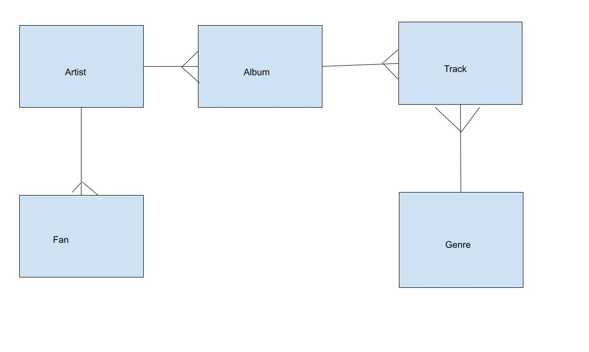

# Intro to SQL

## What is SQL?
- Structured Query Language
- Language to manage (talk to) databases
- Analogy: excel spreadsheets (database); tabs (tables)

- What problems does it solve?
    - Relational databases
    - Persist data

- What kind of databases are there?
    - Relational databases: structured
    - non relational databases: unstructured

- What is CRUD?
    - Create data
    - Read data
    - Update data
    - Delete data
 

1. Install the SQLite Browser if you haven't already [here](http://sqlitebrowser.org/)
2. Open the SQLite Browser and click 'File -> Open DataBase'
3. Choose the `chinook.db` file from this repo. This database is open source and maintained by Microsoft (SQL is no fun if you don't have any data)
4. Click the tab that says 'Execute SQL'. Type SQL queries in the box above. Press the play button. See the results of that query in the box below


## ERD


## Challenges

1. Write the SQL to return all of the rows in the artists table?

```SQL
SELECT * FROM artists;
```

2. Write the SQL to select the artist with the name "Foo Fighters"

```SQL
SELECT name FROM artists WHERE name="Foo Fighters";
```

3. Write the SQL to create a table named 'fans' with an autoincrementing ID that's a primary key and a name field of type text

```sql
CREATE TABLE fans(
    name TEXT,
    id INTEGER PRIMARY KEY
);
```

4. Write the SQL to alter the fans table to have a artist_id column type integer?

```sql
ALTER TABLE fans ADD COLUMN artist_id INTEGER;
```

5. Write the SQL to add yourself as a fan of Green Day (id 54)

```sql
INSERT INTO fans (name, artist_id) VALUES ("Eric", 54);
```

6. How would you update your name in the fans table to be your new name?

 ```sql
UPDATE fans SET name="Eric" WHERE id=1;
 ```

6.5. How would you delete a fan?

```sql
DELETE FROM fans WHERE id=1;
```

7. Write the SQL to return fans that are not fans of the black eyed peas.

```sql
SELECT * FROM fans WHERE artist_id != 169;
```

8. Write the SQL to display an artists name next to their album title

```sql
SELECT * FROM artists
JOIN albums
ON artists.id = albums.artist_id;

SELECT name, title FROM artists
JOIN albums
ON artists.id = albums.artist_id;
```

9. Write the SQL to display artist name, album name and number of tracks on that album

AGGREGATE FUNCTION

```sql
SELECT artists.name, title, COUNT(tracks.id) FROM artists
JOIN albums
ON artists.id = albums.artist_id
INNER JOIN tracks
ON albums.id = tracks.album_id
GROUP BY albums.id;
```

